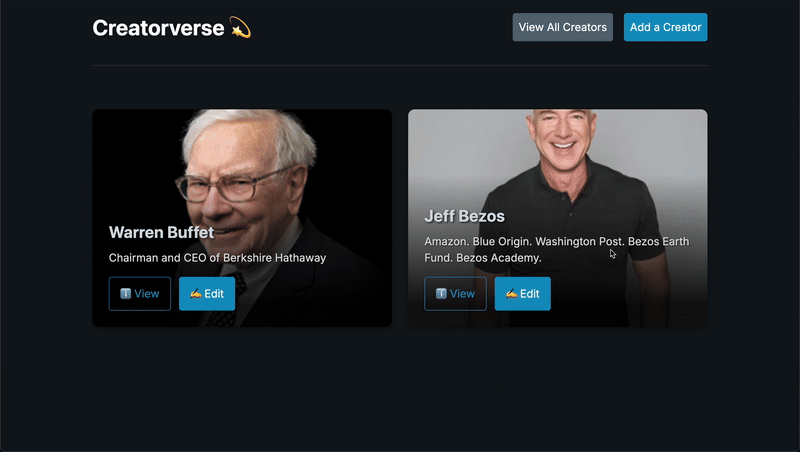

# WEB103 Prework - *👉🏿 Creatorverse*

Submitted by: **👉🏿 Evan Lu**

About this web app: **👉🏿 Creatorverse is a dynamic frontend web application built with React that serves as a digital showcase for a user's favorite content creators. It provides full CRUD (Create, Read, Update, Delete) functionality, allowing users to view a gallery of creators, add new ones through a dedicated form, inspect individual profiles on detailed pages, and easily modify or remove existing entries. The entire application is powered by a Supabase backend, ensuring all data is persistent, and features a sleek, modern interface with interactive cards that make browsing and managing the creator list an engaging experience.**

Time spent: **👉🏿 ~6** hours

## Required Features

The following **required** functionality is completed:

<!-- 👉🏿👉🏿👉🏿 Make sure to check off completed functionality below -->
- [X] **A logical component structure in React is used to create the frontend of the app**
- [X] **At least five content creators are displayed on the homepage of the app**
- [X] **Each content creator item includes their name, a link to their channel/page, and a short description of their content**
- [X] **API calls use the async/await design pattern via Axios or fetch()**
- [X] **Clicking on a content creator item takes the user to their details page, which includes their name, url, and description**
- [X] **Each content creator has their own unique URL**
- [X] **The user can edit a content creator to change their name, url, or description**
- [X] **The user can delete a content creator**
- [X] **The user can add a new content creator by entering a name, url, or description and then it is displayed on the homepage**

The following **optional** features are implemented:

- [X] Picocss is used to style HTML elements
- [X] The content creator items are displayed in a creative format, like cards instead of a list
- [X] An image of each content creator is shown on their content creator card

The following **additional** features are implemented:

* [X] List anything else that you added to improve the site's functionality!

## Video Walkthrough

Here's a walkthrough of implemented required features:

👉🏿

GIF created with ...  👉🏿 MacOS bulit-in screen recorder + ezgif.com (video to gif converter)

## Notes

* **Text Readability on Cards:** Ensuring text remained legible on top of dynamic background images required adding a dark gradient overlay.
* **Asynchronous Data Handling:** Managing component rendering while waiting for data to be fetched from Supabase necessitated the use of loading states and conditional rendering to prevent errors.
* **Supabase Configuration:** Initial connection issues were often traced back to easily missed settings, like leaving Row Level Security (RLS) enabled, which blocked data requests.
* **State Management:** Keeping the UI in sync with the database after a user creates, updates, or deletes a creator required careful handling of state and navigation.

## License

Copyright [👉🏿 2025] [👉🏿 Evan Lu]

Licensed under the Apache License, Version 2.0 (the "License"); you may not use this file except in compliance with the License. You may obtain a copy of the License at

> http://www.apache.org/licenses/LICENSE-2.0

Unless required by applicable law or agreed to in writing, software distributed under the License is distributed on an "AS IS" BASIS, WITHOUT WARRANTIES OR CONDITIONS OF ANY KIND, either express or implied. See the License for the specific language governing permissions and limitations under the License.